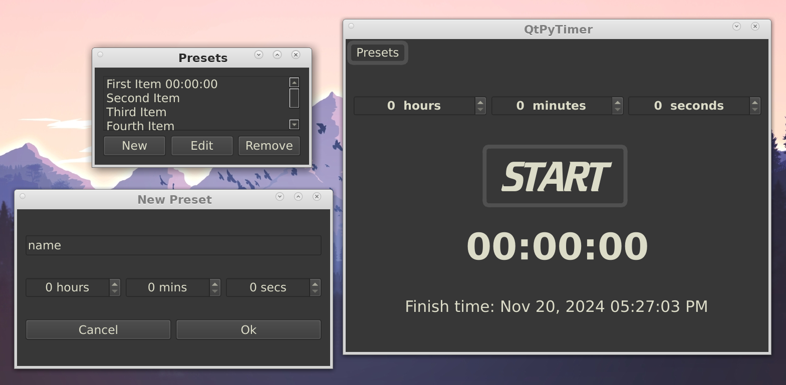

# Introduction  
Yet another kitchen timer app in python using PySide6 (Qt)  
This is another rewrite of an app I wrote years ago in C++.  
This is an extended version from the original with editable presets.  
  
All code that I have written in this repo I have released undet the MIT license.  
Do whatever you want with it, but remember that this was written as a learning  
exercise for me, and may not be following best practices, nor may it be fit for purpose.  

# Installation  
.QtTimer is the configuration file, and should be created in your home directory.  
Here is the contents of mine:  
  
>`{`  
>`"file": ".local/share/QtTimer/chime.wav",`  
>`"qss": "Python-projects/kitchen-timer-QtPy/QtPyTimer.qss",`  
>`"presets": ".local/share/QtTimer/presets.txt"`  
>`}`  

If using the file above:  
The chime.wav file should be placed in your $HOME/.local/share/QtTimer/ directory.  
The presets.txt file should be in the same directory and is just plain text, so you can edit it
with any text editor if you want to.  
QtPyTimer.qss is Qt's version of css and is used to theme applications. The theme I wrote is a simple one.  
Feel free to play with it, and also to supply your own chime.wav file.  

Of course, you can write your own config file according to your desired locations. The only  
file that must be located in your $HOME is .QtTimer. Having said that, you can even edit kitchen_timer_config.py  
and change the location of the config file!  

You should set up a virtual environment in the source dir and activate it before running the
program.  

A simple shell script to invoke kitchen-timer-QtPy is:  

>`#!/bin/sh`  
>`source $HOME/[Path to source]>/kitchen-timer-QtPy/.venv/bin/activate`  
>`$HOME/Python-projects/kitchen-timer-QtPy/kitchen_timer_qt.py`  

Change its permissions to be executable and you can then run the app by executing the script.  

To run it from your task bar put this script in an appropaitely-named file and call it from a custom launcher.

